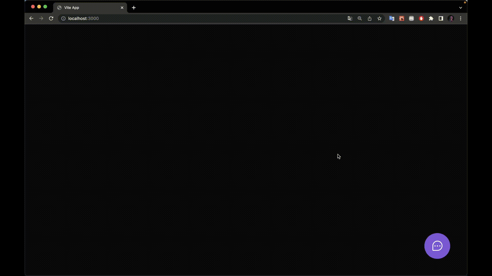

# NLW Return Impulse ↩️🚀

<p align="center">
  <a href="#api">API</a> •
  <a href="#web">WEB</a> •
  <a href="#mobile">MOBILE</a>
</p>
<p>Na semana NLW Return da Rocketseat teve muito conteúdo bom. O Prisma trabalhando com migrations, a API construída com padrões de arquitetura limpa, o web utilizando o Vite APP que traz uma árvore de dependências mais limpa que o CRA. Entretanto, não me agradou muito o tailwindcss que deixou os arquivos do React com linhas que ultrapassam o tamanho estipulado pelo Livro Clean Code de Robert C. Martin.</p>
<h4 align="center"><a href="https://nlw-return-impulse-web-xi.vercel.app/">Clique aqui para ver o projeto na web</a></h4>

## Pré-requisitos
Antes de começar, é necessário ter instalado no computador algumas ferramentas: [git](https://git-scm.com/downloads) para fazer o download do projeto, do [node](https://nodejs.org/en/download/) para rodá-los, e do [vscode](https://code.visualstudio.com/download) para poder editar os arquivos.

```bash
# Clone este repositório
$ git clone https://github.com/jrbytes/nlw-return.git

# Navegue até a pasta que for executar; em seguida, execute os comandos abaixo para cada app, instalando as dependências, preparando o ambiente e executando-os...
$ cd server
```

# API
Como executar:

1. Instalar todas as dependências com: 🚀npm install
2. Configurar o banco de dados em server/prisma/schema.prisma, mais prático seria utilizar o db local sqlite.
3. O nodemailer está configurado para testar o envio de e-mail, no projeto o serviço que testa é o mailtrap, basta criar uma conta e configurar. A interface deles é super intuitiva.
4. Após a configuração do banco de dados e do serviço de e-mail, basta rodar: 🚀npm run dev
5. É possível gerenciar o banco de dados local com o Prisma Studio, basta rodar: 🚀npx prisma studio


# WEB
<h1 align="center">
  
</h1>
Como executar:

1. Instalar todas as dependências com: 🚀npm install
2. Rodar: 🚀npm run dev

# MOBILE
<h1 align="center">
  
</h1>
Como executar

1. Instalar todas as dependências com: 🚀npm install
2. Rodar: 🚀expo start
3. No terminal após o expo iniciar, ele disponibiliza várias formas de executar o app: Browser, Android, iOS...

## Tecnologias

As seguintes ferramentas foram utilizadas para construção do projeto:
- [TypeScript](https://www.typescriptlang.org)
- [Node](https://nodejs.org/en/)
- [Prisma](https://www.prisma.io)
- [Express](https://expressjs.com/pt-br/)
- [React](https://pt-br.reactjs.org)
- [tailwindcss](https://tailwindcss.com)
- [React Native](https://reactnative.dev)
- [Expo](https://expo.dev)
